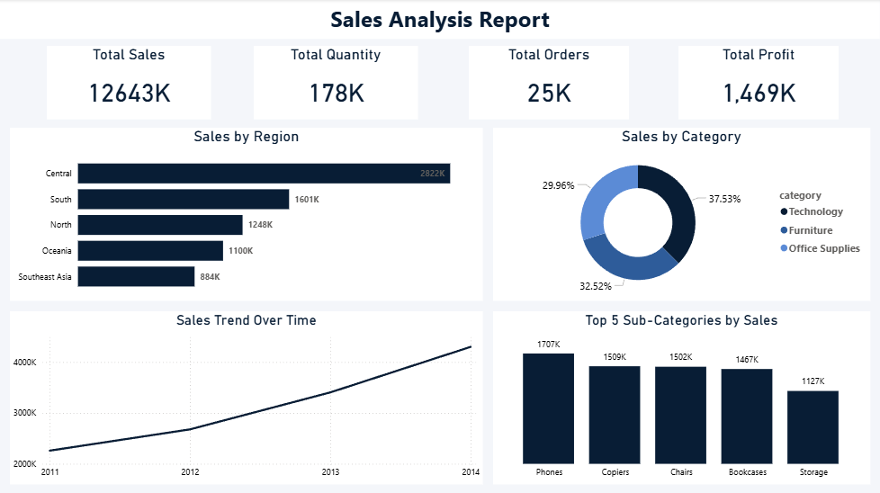

# FUTURE_DS_01
Sales Analysis Dashboard using Power BI

## 📊 Project Overview
This project focuses on creating a professional Sales Analysis Dashboard using Power BI.The dashboard provides insights into sales performance, profit, quantity sold, and total
orders across different regions, categories, and time periods.The objective of this task is to build a clean, simple, and business-oriented dashboard that supports decision-making.

## 📁 Dataset
- SuperStore Orders Dataset

## 🔧 Data Preprocessing
Before building the dashboard, the dataset was cleaned and prepared as follows:
- Removed unnecessary columns:
    - Ship Mode
    - Product ID
    - Market
    - Shipping Cost
    - Order Priority
- Verified and corrected data types for numerical and date columns
- Removed duplicate records to avoid incorrect aggregation
- Retained only analysis-relevant columns such as:
    - Order Date
    - Region
    - Category
    - Sub-Category
    - Sales
    - Quantity
    - Profit

## 📈 Dashboard Components

### 🔹 KPI Cards
- **Total Sales**    : Displays overall revenue generated.
- **Total Quantity** : Shows total number of items sold.
- **Total Profit**   : Indicates overall profitability.
- **Total Orders**   : Represents total number of orders placed.

### 🔹 Visualizations
- **Sales by Region**       : Compares sales performance across regions.
- **Sales Trend Over Time** : Shows sales changes and trends over time.
- **Sales by Category**     : Displays contribution of each category to total sales.
- **Top 5 Sub-Categories by Sales**: Highlights the best-performing sub-categories.

## 🎨 Dashboard Design
- Light grey canvas background
- Dark blue primary color for a professional look
- Clean and minimal layout
- Clear titles and readable visuals

## 🛠 Tools Used
- Power BI Desktop
- GitHub

## 🖼 Dashboard Preview

## 👤 Created by
- Bharanisri P
